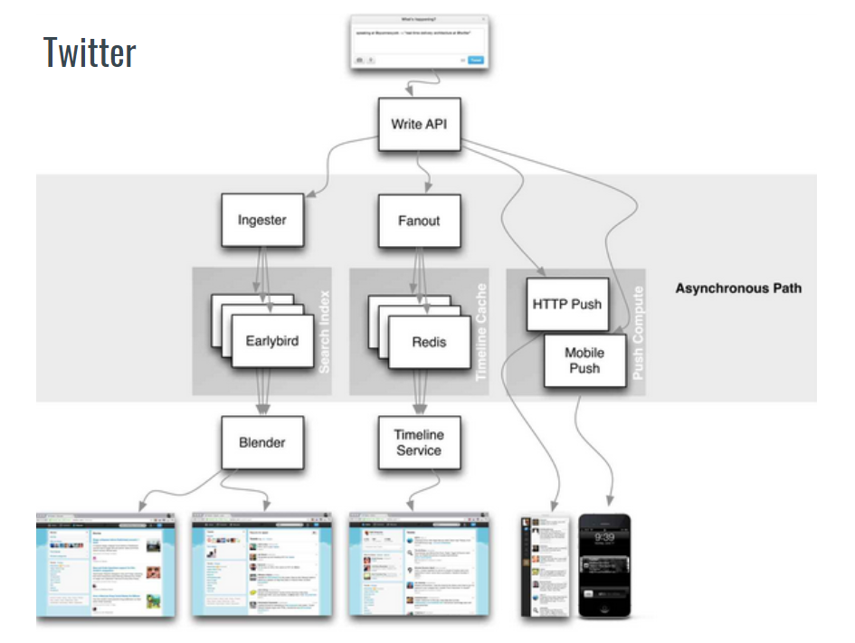
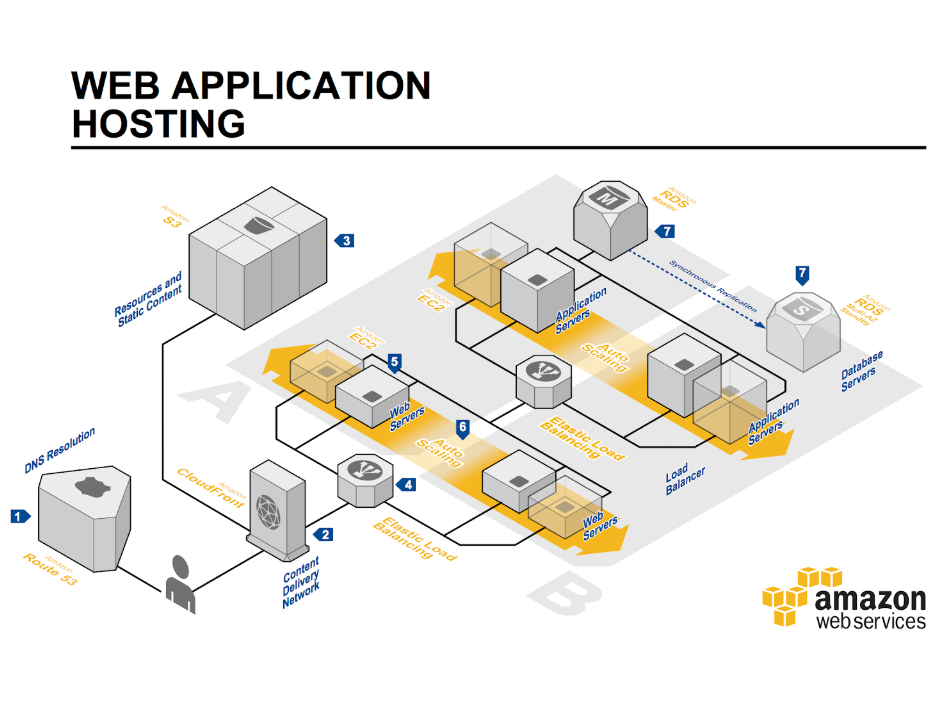
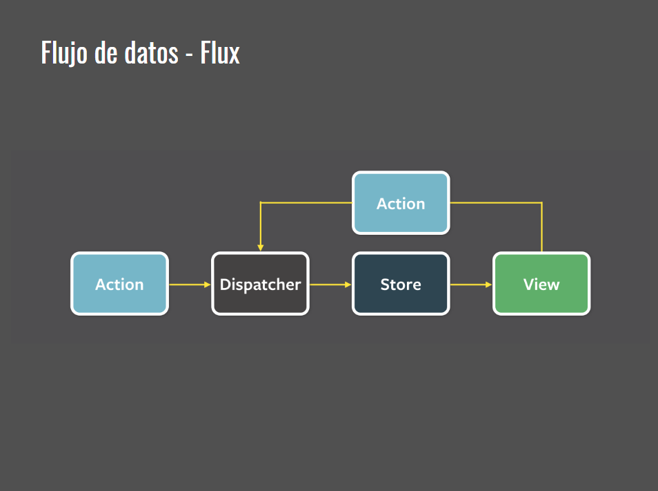

**Etapas del desarrollo de Software**

* Análisis de Requerimientos
* Diseño de Solución
* Desarrollo y Evaluación
* Despliegue 
* Mantenimiento y evolución

*Análisis de Requerimientos*

Todo empieza con un disparador, una idea, un problema a resolver, un análisis de mercado, entre otros. Se tiene que entender que se va a construir. Para ello necesitamos hacer descubrimientos de estos requerimientos.

Tipos de requerimientos: De negocio, de usuario, funcionales, no funcionales.

El resultado es una comprensión muy clara del problema a resolver.

*Diseño de Solución*

Análisis profundo del problema y propuesta de diseño de una solución al problema, un analista de negocio y un arquitecto o equipo de desarrollo plantean las posibles soluciones al problema (modelos, documentación, productos open source, frameworks, entre otros), todo esto entendiendo cual es la propuesta de valor que se va a construior, el resultado debe ser un detalle de esta solución (requerimientos, documentación, modelado, entre otros).

*Desarrollo y evaluación*

El programador está implementando la solución, evaluándola, ejecutando test. 

Criterios de aceptación de la solución: Integración entre esta etapa y la anterior. Set de requerimientos necesarios para construir esta solución, y cómo se evalúan. Una vez terminada esta etapa se tendrá un artefacto de software para ser llevado al despliegue.

*Despliegue*

Representa la entrega al usuario. Se necesita infraestructura y roles de operación para colocar el artefacto a disponibilidad (Servidores, Infraesctura, Store, entre otros)

*Mantenimiento y evolución*

Atentos a la detección de errores y cualquier tipo de nueva funcionabilidad que la aplicación pueda necesitar. El software se mantiene hasta que se decida que ya no es necesario. Al momento que un software no es necesario su ciclo de vida puede concluir y se cataloga como un sistema deprecado. 

**Dificultades**

*Tipos de dificultades a solucionar:*

* Dificultades esenciales:

Entender el concepto de lo que se va a solucionar, entender el diseño de lo que se va a realizar (espeficifación, diseño y comprobación del concepto).

Tipos de dificultades esenciales:

   - Complejidad: Cuando un dominio de dificultades es complejo en sí mismo. Por ejemplo, si tuvieramos que resolver problemas de transporte, el calcular la mejor ruta entre ciudades es un problema que puede ser complejo, puede requerir mucho tiempo de cálculo y optimización de rutas. También si le vamos agregando detalles como los horarios de trabajo del conductor, comidas y paradas, se va aumentando la complejidad del problema.

   - Conformidad: El contexto del software y como debe adecuarse al contexto al que se va a integrar. Por ejemplo, ¿Vamos a tener disponibilidad de internet en todo momento? ¿Que calidad de internet vamos a tener? ¿Tenemos que modelar con respecto a eso? ¿Vamos a tener comunicación entre diferentes piezas de software? ¿Puede no existir esa comunicación, más allá de si va a ser o no, a través de internet?.

   - Tolerancia al cambio: Una vez que se termine el software va a poder cambiarse o va a ser complicado de cambiar, el problema de la tolerancia no tiene nada que ver con la tecnología que decidimos utilizar y su implementación, sino más bien con cuanto cambia el problema que se está resolviendo y cuanto podemos adaptarnos al cambio.

   - Invisilibdad: Lo que hace complicado trabajar un software es su intangibilidad, esto hace que no se pueda entender en todo momento su forma. No significa que no tenga forma, significa que su forma está plasmada en código, estructura, diferentes momentos de decisiones que quizás no quedaron plasmados o no, y todo ésto es invisible, en general lo único que vemos de un software es su interfaz. 

* Dificultades accidentales: 

Plataforma en la que se va a implementar, tecnoloías que se van a utilizar, lenguaje, frameworks, integraciones, entre otros. (Detalles de la implementación y producción actual).

Tipos de dificultades accidentales:

   - Lenguajes de alto nivel: Se refiere al lenguaje que entiende la máquina, la intención del lenguaje de alto nivel es acercar el lenguaje humano al binario.

   - Multi-procesamiento: Resuelve el problema de esperar el hilo de ejecución. Solución accidental, viene dado por estado evolutivo de la tecnología. Sin embargo no resuelve el problema esencial en la programación. 

   - Entornos de programación: Desde las tarjetas perforadas hasta los entornos de desarrollo que puede ayudarte a saber que funciones tienes disponibles para cuales objetos. Esto tiene que ver con los lenguajes que se utilizan, las libreías y capacidad de ejecutar código que ya está disponible. Todo esto es accidental al contexto actual nuestro. 

**Cómo resolver las dificultades esenciales?**

* No desarrollar, adquirir (comprar) un sistema que solvente esa solución.

* Aprovechar el open source.

* Prototipado rápido, metodologías ágiles: obtener feedback lo antes posible de si estamos obteniendo los resultados esperados (resolviendo el problema adecuado), el sistema va evolucionando a pasos pequeños y siempre obteniendo feedback por parte del usuario, el feedback es la herramienta más importante del desarrollo de software moderno, no se debe obtener feedback en un proceso avanzado. 

**Nota:** Necesitamos grandes diseñadores, los grandes diseñadores no son personas que saben usar una tecnología, son desarrolladores que saben abstraerse de un problema puntual y entender un problema más general, saben diseñar una solución elegante y simple, que puedan diseñar un sistema que resuelva de la mejor forma un problema y a la vez ofrezca la mejor calidad. 

**Roles**

*Tradicionales*

 * Experto del dominio: Persona a la que se acude para resolver las necesidades de los requerimientos.

 * Analista: Ya sea funcional o de negocios, es la persona que indaga en que es lo que hay que resolver, define el problema y los requerimientos que van a llevar al software por un buen camino.
 
 * Administrador de sistema (sysadmin): Luego de hacer el despligue, se encargan de toda la operación del sistema, si hay servidores se encargan de mantener el servidor, de mantener actualizadas las librerias del sistema operativo, encontrar errores en los logs y dar ese feedback a los equipos de desarrollo. 

 * QA - Tester: Estrictamente la evaluación del software (manual o automatizado) 
 
 * Desarrollador: Etapa de desarrollo.
 
 * Arquitecto: Diseño de la solución y análisis de los requerimientos, especialmente los no funcionales y arquitectónicamente relevantes. 

 * Gestor del proyecto: Entregas, cumplir con el plan, toda gestión del ciclo de vida.

*Metodologías Agiles*
 
 * Partes interesadas (stakeholders): Este rol es asumido por el dueño del producto para saber que necesidad debe cubrir su producto en todo moment.

 * Cliente / Dueño del producto: Define los requerimientos, tiene el rol de armar esas historias de usuario que van a ir definiendo y van a ser priorizadas para poder ir construyendo el software a medida que el personaje encuentra que se necesita resolver. Algunos procesos ágiles hacen un desarrollo fuerte sobre historias antes de empezar y otros empiezan con una parte y luego van agregando historias. 

 * DevOps / SRE (site reliability engineer): Persona responsable de entender la infraestructura a la que va la aplicación y entender esos requerimientos. Ingeniero de la confianza del sitio. 

 * Equipo de Desarrollo: Asumen los roles de los testers, desarrolladores y arquitectos. La arquitectura, según el manifiesto Agile debe emerger de un equipo autogestionado. 

 * Facilitador: Llevar el equipo a través del ciclo de desarrollo. Entender siempre que pasa con el equipo. 

 **Arquitectura de Software**

 ¿*Qué es?*

La arquitectura llega a modelos y plantea modelos haciendo un estudio fuerte de que es lo que hay que construir, cuales son los requerimientos que se deben tomar, y como es que ese sistema los va a resolver. Puede ser referida en base a la estructura, o en base a las decisiones principales de diseño tomadas para el sistema. Se reduce a las cosas importantes, cualquiera que sean. 

*Ejemplo:*

<figure>

<figcaption>Ejemplo de parte de la arquitectura de Twitter.</figcaption>
</figure>

<figure>

<figcaption>Ejemplo de un sistema de despliegue en AWS.</figcaption>
</figure>

**Nota:** Amazon se preocupa por la vista arquitectónica que tiene que ver con el despliegue de la aplicación.

<figure>

<figcaption>Ejemplo de la arquitectura de Flux. Aplicación Frontend de React, en éste diagrama puedes observar como Flux se concentra en mostra el flujo de datos, cual va a ser la conexión entre diferentes módulos y como los datos van a viajar de un módulo a otro, particularmente en Flux, en una sola dirección.</figcaption>
</figure>

Todos estos diagramas hablan de alguna forma a alto nivel de un sistema de software, y lo particular es que cada de estos diagramas muestra una vista diferente, arquitectónicamente relevante, pero diferente a la hora de evaluar los criterios o atributos de calidad del software, por ejemplo, en Flux vemos que es importante el flujo de datos, mientras que para Amazon es importante la disponibilidad y distribución de carga de la aplicación, todo esto es importante a la hora de decidir una arquitectura.